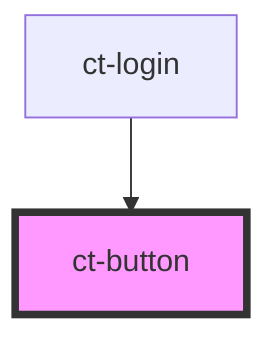

# ct-button

<!-- Auto Generated Below -->

## Properties

| Property            | Attribute  | Description | Type      | Default     |
| ------------------- | ---------- | ----------- | --------- | ----------- |
| `disabled`          | `disabled` |             | `boolean` | `false`     |
| `text` _(required)_ | `text`     |             | `string`  | `undefined` |

## Events

| Event      | Description | Type               |
| ---------- | ----------- | ------------------ |
| `btnClick` |             | `CustomEvent<any>` |

## Dependencies

### Used by

 - [ct-login](../login-component)

### Graph

----------------------------------------------

*Built with [StencilJS](https://stenciljs.com/)*
