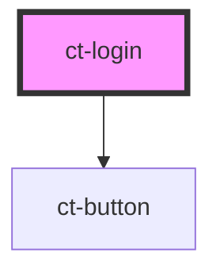

# ct-login

<!-- Auto Generated Below -->

## Events

| Event   | Description | Type                           |
| ------- | ----------- | ------------------------------ |
| `login` |             | `CustomEvent<UserCredentials>` |

## Dependencies

### Depends on

- [ct-button](../button-component)

### Graph

----------------------------------------------

*Built with [StencilJS](https://stenciljs.com/)*
